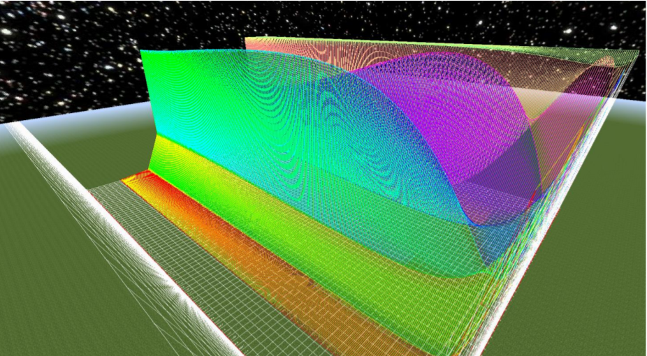
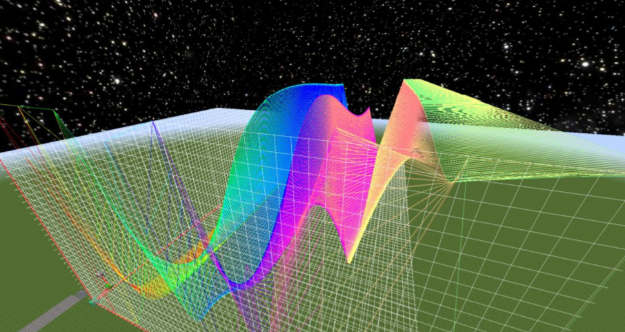

# 3Dvisual

This is the 3D plotter program for my Masters thesis. It implements the Delaunay reconstruction algorithm for multi-dimensional data points. This program generates its plot in Aurora VR Mod, a Mod of the Minecraft game engine. It provides interactive rendering and such capabilites to visualize scientific data for example the time series data produced by the Copasi model i.e the Heat Shock Response.

###Sample rendering:

###Dependencies :

docopt==0.6.2
numpy==1.9.2
matplotlib==1.4.2

###How to run:

Step1:

If python is not installed, install the latest Python(x,y) from this location: https://code.google.com/p/pythonxy/wiki/Downloads (It comes bundeled with both Numpy and Matplotlib library)

If python already installed Run pip install -r requirements.txt

If Numpy or Matplotlib fails to install, you may need to create a virtual environment and install the Python(x,y)

